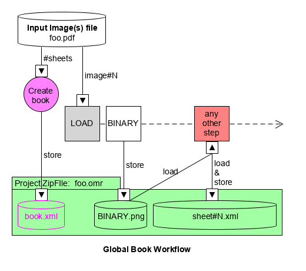
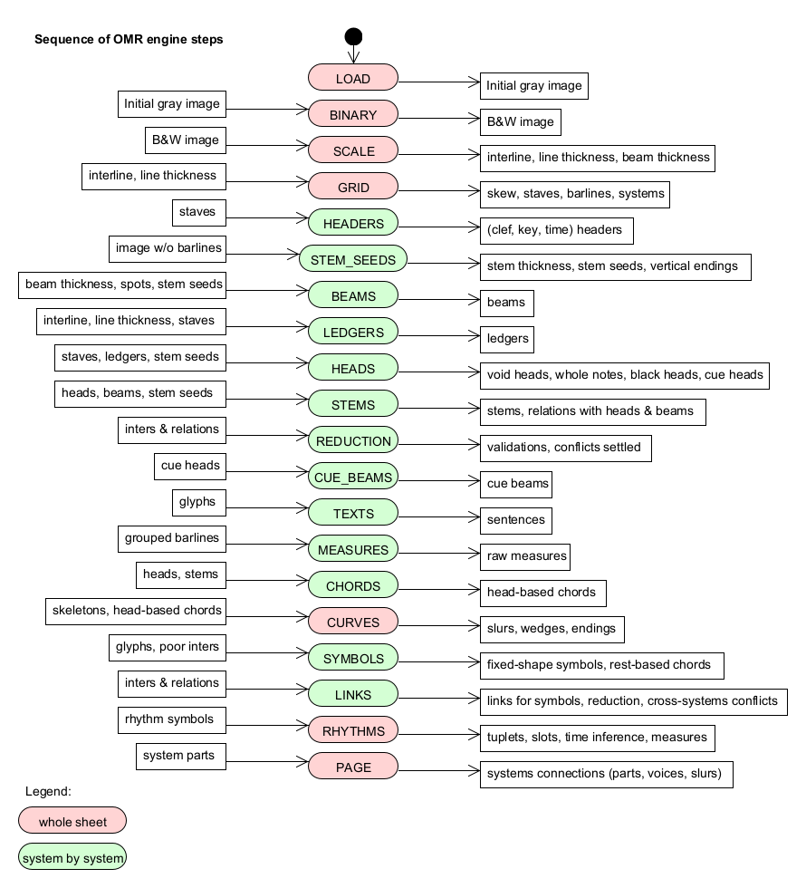

## Pipeline
{: .no_toc }

Table of contents
{: .no_toc .text-delta }

1. TOC
{:toc}

---

### Global Book Workflow
When working on a book, Audiveris V5 OMR engine can process any sheet of the book independently of
the others.
Only the final gathering of sheets results, which comparatively is a very fast action,
is performed at book level.

The diagram above presents the typical workflow for an example input file, named `foo.pdf`:
1. When opening the `foo.pdf` input file, Audiveris creates a Book instance.
2. It then detects how many images the input file contains, and allocates one sheet
(just a sheet "stub" actually) for each contained image.
3. When processing a given sheet, the corresponding image is loaded from the input file,
and the OMR pipeline is applied on the sheet.
4. At any time, when saving the project, all the book and sheets OMR information is saved into the
`foo.omr` project file.

{: .highlight }
**TIP**: Audiveris V5 can accommodate a book of hundreds of sheets.
To save on memory, especially during long interactive sessions, we can ask Audiveris to
transparently swap all book sheets to disk (except the current sheet).
This is done via the pulldown menu `Book | Swap Book Sheets`.

### Sheet Pipeline

The processing of a given sheet by the OMR engine is done via a pipeline of some 20 steps
applied, one after the other, on sheet OMR data.

Here below is the sheet pipeline sequence, with the main inputs and outputs of every step:

### Driving the Pipeline

A sheet step is like a mini-batch applied on the sheet data, and this is the smallest increment
that the OMR engine can perform.

In the selected sheet,  we can decide to move the pipeline forward until a target
step.
To do so, we select the target step in the pulldown `Step` menu:

Note that selecting the pulldown menu `Sheet | Transcribe Sheet` is just another way of selecting
the pulldown menu `Step | PAGE`.

Beware that we cannot directly move the pipeline backward.
There are two workarounds:
* Selecting a target step that has already been performed will, after user confirmation,
  reset the sheet data to its BINARY step, then perform all necessary steps up to the target step.
* We can abandon the book and reload it from a previously saved version.
