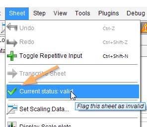
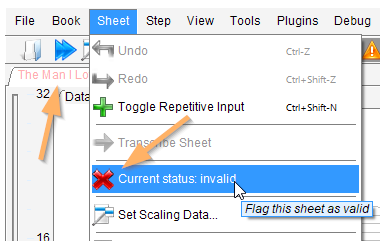

## Sheet Validity
{: .no_toc }

All images in an input file may not be score images: we can find illustration pages, blank pages, etc.
Generally, the SCALE step is smart enough to detect that there is not enough "staff material" in
a sheet and thus detect an invalid sheet from the OMR point of view.

When running in batch, the engine sets the _invalid_ flag to the sheet.
When in interactive mode, we are prompted to confirm whether the sheet is really invalid.

How to know if a given sheet has been set to valid or invalid?

In the `Sheet` pull-down menu, we can look at the `Current status` item:
- It indicates the sheet current validity status
- By pressing on the menu item, we toggle the sheet validity status.

| Valid sheet | Invalid sheet|
| ----------- | ------------ |
|   |   |

Also, the text on sheet tab turns red for an invalid sheet.

We can decide to display or not the tabs for invalid sheets,
via menu item `View | Display invalid sheets`.

A sheet declared as `invalid` is no longer processed:
no transcription, no export, no printing, nothing!
Unless of course if we detect we've made a mistake and decide to set it back to `valid`
after all!

But validity is supposed to represent the real status of the sheet from OMR perspective,
don't use it to include or exclude this sheet for some processing.
A side effect of modifying the validity status of a sheet is to nullify all its OMR data!

Instead, use the sheet selection mechanism or the even more powerful 'Split and Merge' tool.
